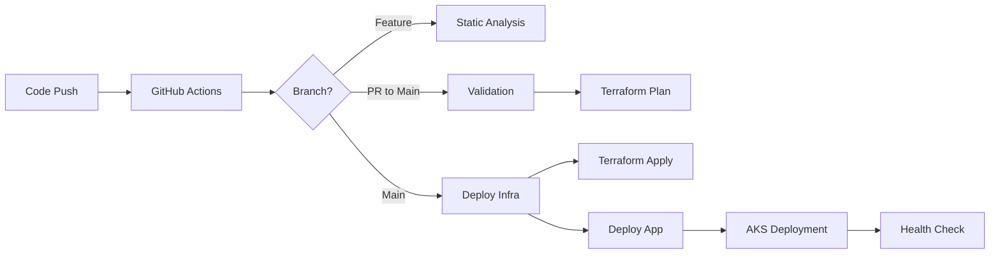

# CST8918 Final Project - Remix Weather App on Azure

A complete Infrastructure as Code (IaC) solution for deploying a Remix Weather application on Azure Kubernetes Service (AKS) using Terraform with automated CI/CD pipelines through GitHub Actions.


## 👥 Team Members

| Name | GitHub Profile | Role |
|------|---------------|------|
| [Your Name] | [@yourusername](https://github.com/yourusername) | Team Lead / DevOps Engineer |
| [Team Member 2] | [@member2](https://github.com/member2) | Infrastructure Developer |
| [Team Member 3] | [@member3](https://github.com/member3) | Application Developer |

> **Note**: Please update the team member information above with actual names and GitHub profile links.

## 🎯 Project Overview

This project showcases modern DevOps practices by implementing:

- **Infrastructure as Code** using Terraform
- **Containerized Application** with Docker
- **Kubernetes Orchestration** on Azure AKS
- **CI/CD Automation** with GitHub Actions
- **Multi-Environment Deployment** (Test/Production)
- **Azure Cloud Integration** with OIDC authentication

## 🏗️ Architecture Overview

```
├── .github/workflows/       # GitHub Actions CI/CD Pipelines
│   ├── terraform-static-analysis.yml    # Code quality & security
│   ├── infra-ci-cd.yml                  # PR validation & planning
│   ├── infra-ci-cd-terraformapply.yml   # Infrastructure deployment
│   ├── build-push-weather-app.yml       # Docker build & push
│   └── deploy-remix-to-aks.yml          # AKS application deployment
│
├── infra/                   # Terraform Infrastructure
│   ├── main.tf             # Root module configuration
│   ├── variables.tf        # Input variables
│   ├── outputs.tf          # Output values
│   ├── terraform.tfvars    # Variable values
│   │
│   ├── backend/            # Terraform State Management
│   │   ├── main.tf         # Azure Storage for remote state
│   │   ├── variables.tf
│   │   └── outputs.tf
│   │
│   ├── network/            # Base Network Infrastructure
│   │   ├── main.tf         # VNet with 4 subnets
│   │   ├── variables.tf
│   │   └── outputs.tf
│   │
│   ├── aks/                # Kubernetes Clusters
│   │   ├── main.tf         # Test & Production AKS clusters
│   │   ├── variables.tf
│   │   └── outputs.tf
│   │
│   └── remix-weather/      # Application Infrastructure
│       ├── main.tf         # Azure Container Registry & Redis
│       ├── variables.tf
│       └── outputs.tf
│
├── pulumi-app/             # Remix Weather Application
│   ├── Dockerfile          # Container configuration
│   ├── package.json        # Node.js dependencies
│   ├── app/                # Remix application code
│   └── public/             # Static assets
│
└── k8s/                    # Kubernetes Manifests
    └── remix-weather-deployment.yaml    # Application deployment
```

## 🚀 Azure Resources Created

### Network Infrastructure
- **Virtual Network**: 10.0.0.0/14 address space in Canada Central
- **Subnets**: 
  - Production: 10.0.0.0/16
  - Test: 10.1.0.0/16 
  - Development: 10.2.0.0/16
  - Admin: 10.3.0.0/16

### Compute Resources
- **AKS Clusters**: 
  - Test environment (1 node, Kubernetes v1.32.6)
  - Production environment (2 nodes, Kubernetes v1.32.6)
- **Node Size**: Standard_B2s (Azure for Students compatible)
- **Auto-scaling**: Enabled with environment-specific limits

### Container & Storage
- **Azure Container Registry**: Basic SKU with admin access
- **Redis Cache**: For application caching (test & production instances)
- **Storage Account**: Terraform state management with blob storage

### Security & Authentication
- **Azure OIDC Integration**: Passwordless authentication for GitHub Actions
- **Service Principals**: Contributor and Reader roles with federated credentials
- **Managed Identities**: For AKS cluster authentication

## 🔄 CI/CD Workflows

### GitHub Actions Workflows


> **Note**: Please add a screenshot of your completed GitHub Actions workflows to the `docs/images/` directory and update the path above.

#### 1. Terraform Static Analysis
- **Trigger**: Push to any branch
- **Actions**: `terraform fmt`, `terraform validate`, `tfsec` security scanning
- **Matrix Strategy**: Tests across multiple Terraform versions

#### 2. Infrastructure PR Validation
- **Trigger**: Pull request to main branch
- **Actions**: TFLint validation, terraform plan with cost estimation
- **Features**: PR commenting with plan details

#### 3. Infrastructure Deployment
- **Trigger**: Push to main branch (after PR merge)
- **Actions**: `terraform apply` with automatic state management
- **Features**: Enhanced state lock handling, retry mechanisms

#### 4. Docker Build & Push
- **Trigger**: PR to main with changes to `pulumi-app/**`
- **Actions**: Build Docker image, push to ACR, security scanning
- **Features**: Multi-tag strategy (SHA, short SHA, latest)

#### 5. AKS Application Deployment
- **Trigger**: 
  - **Test Environment**: PR to main with app changes
  - **Production Environment**: Push to main with app changes
- **Actions**: Deploy to respective AKS clusters using existing K8s manifests
- **Features**: Environment-specific configuration, health checks

## 🛠️ Prerequisites

### Required Tools
- **Azure CLI** (authenticated with your subscription)
- **Terraform** >= 1.0
- **Docker** (for local testing)
- **kubectl** (for Kubernetes management)
- **Git** for version control

### Azure Setup
1. **Azure Subscription** (Azure for Students or Pay-As-You-Go)
2. **Service Principals** with appropriate permissions
3. **GitHub Repository Secrets** configured

## 🚀 Getting Started

### 1. Clone Repository
```bash
git clone https://github.com/mishsamir/Final-Project-CST8918_Group6.git
cd Final-Project-CST8918_300
```

### 2. Configure Azure Authentication

#### Create Service Principals
```bash
# Create Contributor service principal
az ad sp create-for-rbac --name "CST8918-Final-Contributor" \
  --role Contributor \
  --scopes /subscriptions/YOUR_SUBSCRIPTION_ID

# Create Reader service principal  
az ad sp create-for-rbac --name "CST8918-Final-Reader" \
  --role Reader \
  --scopes /subscriptions/YOUR_SUBSCRIPTION_ID
```

#### Configure GitHub Secrets
Add the following secrets to your GitHub repository:
- `AZURE_CLIENT_ID`: Service principal client ID
- `AZURE_TENANT_ID`: Azure tenant ID
- `AZURE_SUBSCRIPTION_ID`: Azure subscription ID
- `ARM_ACCESS_KEY`: Storage account access key (for Terraform state)
- `WEATHER_API_KEY`: OpenWeatherMap API key (optional)

### 3. Deploy Infrastructure

#### Option A: Using GitHub Actions (Recommended)
1. Create a pull request with infrastructure changes
2. Review the terraform plan in PR comments
3. Merge PR to trigger deployment

#### Option B: Manual Deployment
```bash
cd infra

# Initialize Terraform
terraform init

# Plan the deployment
terraform plan

# Apply the infrastructure
terraform apply
```

### 4. Deploy Application

#### Via GitHub Actions
1. Make changes to `pulumi-app/**` directory
2. Create PR → triggers test deployment
3. Merge PR → triggers production deployment

#### Manual Deployment
```bash
# Get AKS credentials
az aks get-credentials --resource-group cst8918-final-project-group-6 --name aks-prod

# Apply Kubernetes manifests
kubectl apply -f k8s/remix-weather-deployment.yaml --namespace=remix-weather-prod
```

## 🔧 Configuration

### Environment Variables
Key configuration files:
- `infra/terraform.tfvars` - Terraform variables
- `pulumi-app/.env` - Application environment variables
- `k8s/remix-weather-deployment.yaml` - Kubernetes configuration

### Important Settings
```hcl
# terraform.tfvars
location      = "Canada Central"  # Required for Azure for Students
project_name  = "cst8918"         # Used for resource naming
group_number  = "6"               # Your group identifier
```

## 📊 Monitoring & Troubleshooting

### Health Checks
- **Application**: Liveness and readiness probes configured
- **Infrastructure**: Azure Monitor integration
- **Workflows**: GitHub Actions status badges

### Common Issues & Solutions

#### Terraform State Lock
```bash
# Force unlock if needed (get lock ID from error message)
terraform force-unlock LOCK_ID
```

#### AKS Connection Issues
```bash
# Refresh AKS credentials
az aks get-credentials --resource-group RESOURCE_GROUP --name AKS_NAME --overwrite-existing
```

#### Container Registry Authentication
```bash
# Login to ACR
az acr login --name YOUR_ACR_NAME
```

## 📈 Scaling & Production Considerations

### Cost Optimization
- **Resources**: Sized for Azure for Students (Basic/Standard tiers)
- **Auto-scaling**: Configured with appropriate limits
- **Regional Deployment**: Canada Central for policy compliance

### Security Best Practices
- **OIDC Authentication**: No stored credentials
- **Network Security**: Private subnets and security groups
- **Container Security**: Base image scanning and updates
- **RBAC**: Principle of least privilege

## 🧪 Testing

### Infrastructure Testing
```bash
# Validate Terraform configuration
terraform validate

# Security scanning
tfsec .

# Plan review
terraform plan
```

### Application Testing
```bash
# Build Docker image locally
docker build -t remix-weather ./pulumi-app

# Run locally
docker run -p 3000:3000 remix-weather
```

## 🔄 Deployment Workflow



## 🎯 Learning Outcomes

This project demonstrates proficiency in:
- ✅ Infrastructure as Code with Terraform
- ✅ Kubernetes orchestration and deployment
- ✅ CI/CD pipeline automation
- ✅ Azure cloud services integration
- ✅ DevOps best practices
- ✅ Git workflow and collaboration

## 📝 License

This project is created for educational purposes as part of CST8918 - Infrastructure as Code course at Algonquin College.

## 🤝 Contributing

1. Fork the repository
2. Create a feature branch (`git checkout -b feature/amazing-feature`)
3. Commit your changes (`git commit -m 'Add amazing feature'`)
4. Push to the branch (`git push origin feature/amazing-feature`)
5. Open a Pull Request

---

## 📞 Support

For questions or issues:
- Create an issue in this repository
- Contact team members via GitHub
- Reference course materials and documentation

**Course**: CST8918 - Infrastructure as Code  
**Institution**: Algonquin College  
**Term**: Winter 2025
